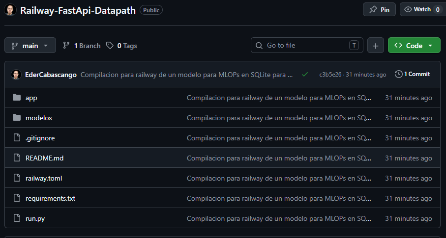
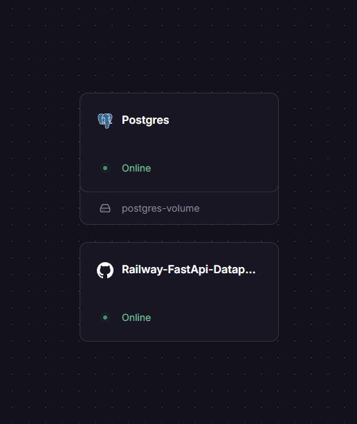
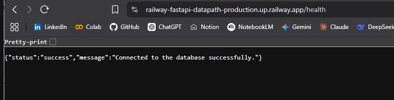
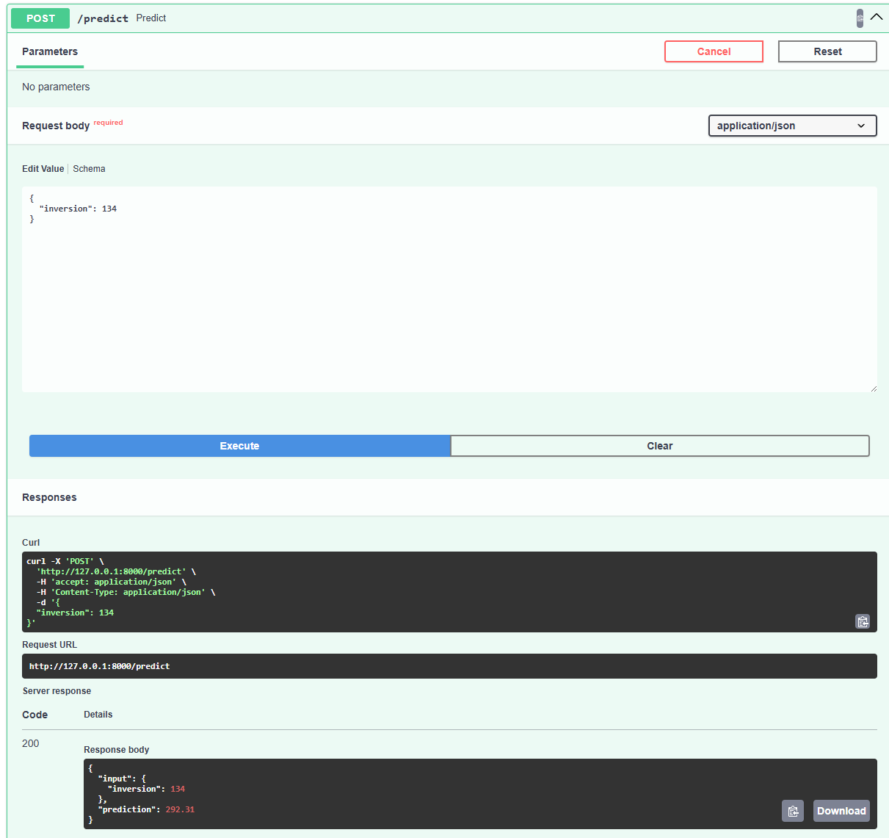
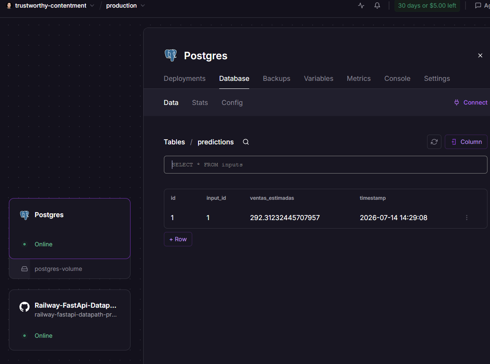

# API de Predicción de Ventas con Persistencia en Base de Datos (MLOps)

Este proyecto consiste en el desarrollo, contenedorización y despliegue de una API de Machine Learning utilizando el framework FastAPI. La API interactúa con bases de datos relacionales para garantizar la persistencia de datos: almacena los valores de inversión ingresados por el usuario en una tabla de inputs y guarda las predicciones de ventas calculadas por un modelo preentrenado en una tabla de predictions.

El proyecto soporta una ejecución híbrida:
1. Local: Utiliza una base de datos ligera SQLite (mlops.db) para pruebas rápidas de desarrollo.
2. Producción (Cloud): Se conecta automáticamente a una base de datos PostgreSQL en Railway mediante variables de entorno (DATABASE_URL).

---

## 🛠️ Tecnologías Utilizadas

* Lenguaje: Python 3.10+
* Framework API: FastAPI
* Servidor ASGI: Uvicorn
* ORM / Base de Datos: SQLAlchemy
* Motores de BD: SQLite (Local) y PostgreSQL (Producción/Railway)
* Librerías de ML: Scikit-Learn, Pandas, Joblib
* Despliegue: Railway (Nixpacks)

---

## 📂 Estructura del Proyecto

```text
Railway - FastApi/
├── app/
│   ├── __init__.py
│   ├── database.py       # Configuración dinámica de la conexión a BD (SQLite/Postgres)
│   ├── main.py           # Endpoints principales de la API (/health y /predict)
│   ├── models.py         # Modelos relacionales de SQLAlchemy (inputs y predictions)
│   └── schemas.py        # Esquemas de validación de datos de Pydantic
├── modelos/
│   └── modelo_ventas.pkl # Modelo regresor preentrenado (.pkl)
├── img/                  # Capturas de evidencia del despliegue
│   ├── 01_github_repository.png
│   ├── 02_railway_dashboard.png
│   ├── 03_api_health_endpoint.png
│   ├── 04_api_docs_swagger.png
│   └── 05_postgresql_persistence.png
├── .gitignore            # Archivos ignorados en el control de versiones
├── railway.toml          # Configuración de despliegue para la nube de Railway
├── requirements.txt      # Dependencias del proyecto para producción
└── run.py                # Script opcional para ejecución local rápida
```
---

## 🚀 Endpoints de la API

### 1. Validación de Conexión (GET /health)
Verifica si la API se comunica exitosamente con el motor de base de datos activo (SQLite o PostgreSQL).

Respuesta de éxito (JSON):
{
  "status": "success",
  "message": "Connected to the database successfully."
}

### 2. Endpoint de Predicción (POST /predict)
Recibe un valor numérico de inversión publicitaria, registra la consulta en la base de datos, ejecuta la inferencia con el modelo cargado en memoria, almacena la predicción enlazada y retorna los resultados al cliente.

Cuerpo de la Petición (Request Body):
{
  "inversion": 150.0
}

Respuesta de éxito (JSON):
{
  "input": {
    "inversion": 150.0
  },
  "prediction": 325.94
}

---

## 💻 Ejecución Local

1. Crear y activar el entorno virtual:
python -m venv .venv
.venv\Scripts\Activate

2. Instalar dependencias:
pip install -r requirements.txt

3. Ejecutar el servidor local:
uvicorn app.main:app --host 127.0.0.1 --port 8000 --reload

4. Probar la API:
Entra a http://127.0.0.1:8000/docs para interactuar con la documentación autogenerada de Swagger UI.

---

## ☁️ Despliegue en Railway

Este repositorio está configurado para desplegarse automáticamente en Railway utilizando el archivo railway.toml. 

* Al conectarse a un servicio de PostgreSQL dentro de Railway, la API leerá la variable DATABASE_URL provista por la plataforma e inicializará automáticamente el esquema de tablas en la base de datos de producción.

## Imagenes de evidencia de funcionamiento
1. Repositorio de Github

2. Dashboard Railway

3. Health del endpoint

4. API en funcionamiento 200

5. Registro en postgresSQL
